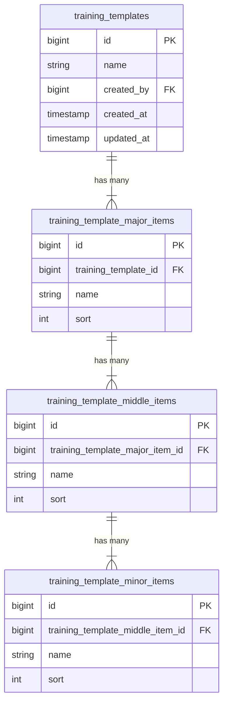

# 研修テンプレート機能のアーキテクチャ

このドキュメントでは、3層の階層構造（テンプレート -> 大項目 -> 中項目 -> 小項目）を管理する「研修テンプレート」機能のアーキテクチャとロジックフローについて説明します。

## 1. データベーススキーマ

データは、カスケード削除が有効な4つの関連テーブルに保存されます。

## 2. バックエンドロジック (Laravel)

### コントローラー: `TrainingTemplateController`

- **保存 (`POST /api/training-templates`)**:
    - ネストされたJSON構造を受信します。
    - 操作を `DB::transaction` でラップします。
    - ルートとなる `TrainingTemplate` を作成します。
    - `major_items`、`middle_items`、`minor_items` をループして順次作成します。

- **更新 (`PUT /api/training-templates/{id}`)**:
    - 更新処理には **同期戦略 (Sync Strategy)** を使用します。
    - **ロジック**:
        1.  現在のレベル（例：大項目）の既存IDを取得します。
        2.  リクエストペイロード内のIDと比較します。
        3.  **削除**: DBには存在するがリクエストには存在しないID。
        4.  **更新**: 両方に存在するID。
        5.  **作成**: IDを持たないリクエスト内のアイテム。
    - このロジックは大項目、中項目、小項目に再帰的に適用されます。

## 3. フロントエンドロジック (React + TypeScript)

### 状態管理
- **TanStack Query**: リストの取得 (`useQuery`) およびミューテーション（作成/更新/削除の `useMutation`）に使用されます。
- **React Hook Form**: 複雑なネストされたフォーム状態を管理します。
- **Zod**: スキーマバリデーションを処理します。

### コンポーネント構造

- **`TemplatesPage`**:
    - テンプレートの一覧を表示します。
    - 「削除」アクションを処理します。
    - エディター用の `Sheet` (Drawer) 状態を管理します。

- **`TemplateEditor`**:
    - コアとなるフォームコンポーネントです。
    - 動的なリスト管理に `useFieldArray` を使用します。
    - **ネスト構造**:
        - `TemplateEditor` (ルートフォーム)
            - `MajorItemField` (レベル 1)
                - `MiddleItemField` (レベル 2)
                    - `MinorItemField` (レベル 3)

### データフロー
1.  **取得**: `TemplatesPage` が `getTrainingTemplates` を介してデータを取得します。
2.  **編集**: 「編集」をクリックすると `TemplateEditor` が開き、`form.reset(data)` でフォームにデータが入力されます。
3.  **送信**:
    - `TemplateEditor` がフォームデータを収集します。
    - 配列のインデックスに基づいて `sort` 順を自動割り当てします。
    - `createTrainingTemplate` または `updateTrainingTemplate` を呼び出します。
4.  **同期**: 成功時、`queryClient.invalidateQueries` がリストをリフレッシュします。

## 4. 主な決定事項
- **同期戦略**: 「すべて削除して再作成」ではなく、プライマリーキー (ID) を維持するために採用されました。これは、将来的にこれらのアイテムを参照する「研修進捗」などの機能にとって重要です。
- **Drawer UI**: リストビューのコンテキストを維持しつつ、ネストされたフォームに十分なスペースを確保するために、エディターには幅広の Drawer を使用しました。
