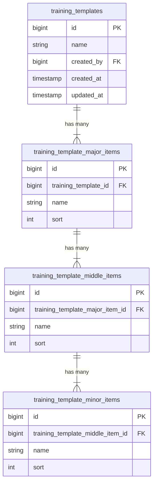

# Training Template Feature Architecture

This document describes the architecture and logic flow for the "Training Template" feature, which manages a 3-layer hierarchical curriculum (Template -> Major Item -> Middle Item -> Minor Item).

## 1. Database Schema

The data is stored in 4 related tables with Cascade Delete enabled.

## 2. Backend Logic (Laravel)

### Controller: `TrainingTemplateController`

- **Store (`POST /api/training-templates`)**:
    - Receives a nested JSON structure.
    - Wraps operations in a `DB::transaction`.
    - Creates the root `TrainingTemplate`.
    - Iterates through `major_items`, `middle_items`, and `minor_items` to create them sequentially.

- **Update (`PUT /api/training-templates/{id}`)**:
    - Uses a **Sync Strategy** to handle updates.
    - **Logic**:
        1.  Fetch existing IDs for the current level (e.g., Major Items).
        2.  Compare with IDs in the request payload.
        3.  **Delete**: IDs present in DB but missing in Request.
        4.  **Update**: IDs present in both.
        5.  **Create**: Items in Request without an ID.
    - This logic is applied recursively to Major, Middle, and Minor items.

## 3. Frontend Logic (React + TypeScript)

### State Management
- **TanStack Query**: Used for fetching lists (`useQuery`) and handling mutations (`useMutation` for create/update/delete).
- **React Hook Form**: Manages the complex nested form state.
- **Zod**: Handles schema validation.

### Component Structure

- **`TemplatesPage`**:
    - Displays the list of templates.
    - Handles "Delete" actions.
    - Manages the `Sheet` (Drawer) state for the editor.

- **`TemplateEditor`**:
    - The core form component.
    - Uses `useFieldArray` for dynamic list management.
    - **Nested Structure**:
        - `TemplateEditor` (Root Form)
            - `MajorItemField` (Level 1)
                - `MiddleItemField` (Level 2)
                    - `MinorItemField` (Level 3)

### Data Flow
1.  **Fetch**: `TemplatesPage` fetches data via `getTrainingTemplates`.
2.  **Edit**: Clicking "Edit" opens `TemplateEditor` and populates the form with `form.reset(data)`.
3.  **Submit**:
    - `TemplateEditor` gathers form data.
    - Auto-assigns `sort` order based on the array index.
    - Calls `createTrainingTemplate` or `updateTrainingTemplate`.
4.  **Sync**: On success, `queryClient.invalidateQueries` refreshes the list.

## 4. Key Decisions
- **Sync Strategy**: Chosen over "Delete All & Recreate" to preserve primary keys (IDs), which is important for future features like "Training Progress" that will reference these items.
- **Drawer UI**: Used a wide Drawer for the editor to maintain context of the list view while offering enough space for the nested form.
